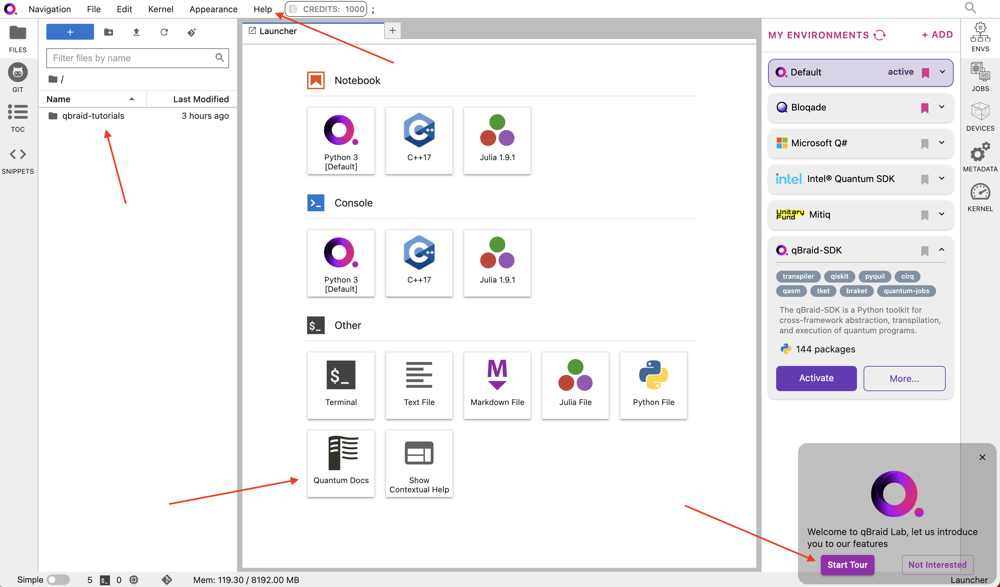

[](https://docs.qbraid.com/projects/lab/en/latest/?badge=latest)
[](https://github.com/qBraid/qBraid-Lab/issues)
[](https://discord.gg/TPBU2sa8Et)

[qBraid Lab](https://lab.qbraid.com) is a web-based JupyterLab deployment providing curated software tools for
for researchers and developers in quantum computing.

This repository contains the Sphinx documentation source code, and also is used to track community [feature requests](https://github.com/qBraid/qBraid-Lab/issues/new?assignees=&labels=type%3A+feature+request&projects=&template=feature_request.yml) and [bug reports](https://github.com/qBraid/qBraid-Lab/issues/new?assignees=&labels=type%3A+bug&projects=&template=bug_report.yml).

[](https://account.qbraid.com?gitHubUrl=https://github.com/qBraid/qBraid.git)

## lab.qbraid.com

- Hosts **30+** configurable quantum software environments in **Python**, **Julia**, **C++**, and **Q#**.
- Integrates with **GitHub**, **VSCode**, **ChatGPT**, and more.
- **Collaborative tools** enable sharing notebooks, environments, and code snippets.
- Provides direct access to a robust suite of computing resources, encompassing scalable **CPUs**, **GPUs**, and **QPUs**.



## Build docs locally

Install requirements

```shell
pip install -r docs/requirements.txt
```

Build docs

```shell
sphinx-build -W -b html docs docs/build/html
```

View html

```shell
open docs/build/html/index.html
```

## Launch on qBraid

The "Launch on qBraid" button (below) can be added to any public GitHub
repository. Clicking on it automaically opens qBraid Lab, and performs a
`git clone` of the project repo into your account's home directory. Copy the
code below, and replace `YOUR-USERNAME` and `YOUR-REPOSITORY` with your GitHub
info.

[](https://account.qbraid.com?gitHubUrl=https://github.com/qBraid/qBraid.git)

Use the badge in your project's `README.md`:

```markdown
[](https://account.qbraid.com?gitHubUrl=https://github.com/YOUR-USERNAME/YOUR-REPOSITORY.git)
```

Use the badge in your project's `README.rst`:

```rst
.. image:: https://qbraid-static.s3.amazonaws.com/logos/Launch_on_qBraid_white.png
    :target: https://account.qbraid.com?gitHubUrl=https://github.com/YOUR-USERNAME/YOUR-REPOSITORY.git
    :width: 150px
```
