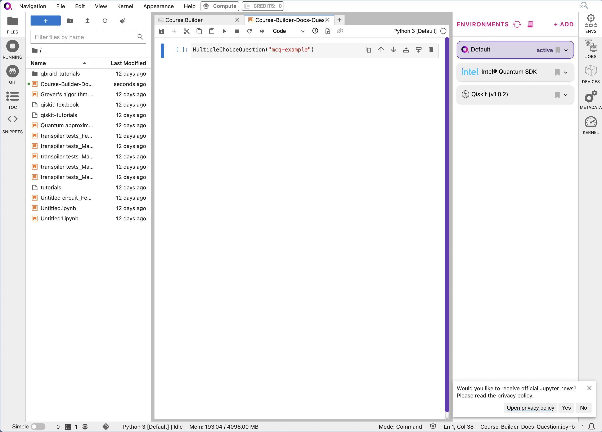
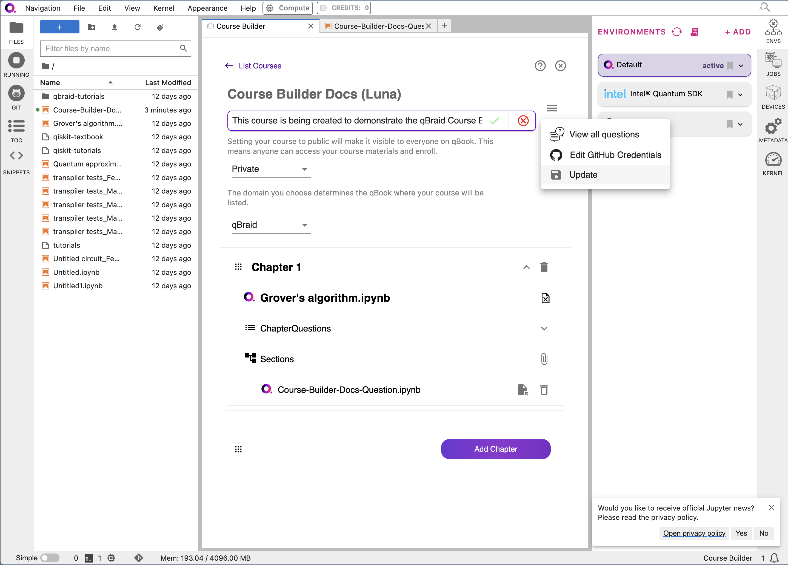

.. _course_builder:

Course Builder
=====================

Guide for educators to create and publish quantum computing (or any) courses on qBraid.

.. note:: 
    This guide applies for users who already have the relevant permissions for adding courses to their qBraid plan. If you are interested in these permissions, please reach out to us at `contact.qbraid.com <mailto:contact.qbraid.com>`_, and we'll get you set up.

Overview
--------

qBraid boasts a comprehensive Course Builder system that allows for the creation of quantum computing courses. This system is designed to be user-friendly and intuitive, allowing educators to create and publish courses with ease. This guide will walk you through the process of creating a course on qBraid.

Step 1: Create an Organization
-------------------------------

The first step in creating a course on qBraid is to create an organization. An organization is a group that can contain multiple courses and people. To create an organization, follow these steps:

1a. Visit the Organizations page on qBraid Accounts.
^^^^^^^^^^^^^^^^^^^^^^^^^^^^^^^^^^^^^^^^^^^^^^^^^^^^

You can find the qBraid Accounts Dashboard at `accounts.qbraid.com <https://accounts.qbraid.com>`_

Once you're there, you can click on the "Organization" tab to view the organizations you are a part of or to create a new organization.

If you already have an organization, you can skip till Step 2. Otherwise, continue to Step 1b.

1b. Create a New Organization
^^^^^^^^^^^^^^^^^^^^^^^^^^^^^

To create a new organization, either click the "Add an organization" button or the "Create an organization" button.

In the pop-up dialog that appears, change the name of the organization and add a description.

After you've filled in the details, add users to the organization. In order for students to join your class, they should first be added to the organization. Then, click "Add Organization".

Refresh and your organization should appear!

Step 2: Create an Organization on GitHub
----------------------------------------

qBraid uses GitHub to validate and link course content. To create an organization on GitHub, follow `these steps <https://docs.github.com/en/organizations/collaborating-with-groups-in-organizations/creating-a-new-organization-from-scratch>`_.

Step 3: Create a Course
------------------------

Once you have created an organization on qBraid and GitHub, you can create a course. To create a course, follow these steps:

3a. Open qBraid Lab.
^^^^^^^^^^^^^^^^^^^^^

Visit `lab.qbraid.com <https://lab.qbraid.com>`_ and log in with your qBraid account. Start the lab environment of your choice from the landing page.

3b. Open the Course Builder.
^^^^^^^^^^^^^^^^^^^^^^^^^^^^

From the Launcher tab, click on the "Course Builder" icon.

You should be prompted for your GitHub organization link. Enter the link in the given field. Retrieve a personal access token from GitHub and enter it in the next field. Click "Continue".

.. note::
    You can use the link on the page to find your Personal Access Token if you're having any difficulty.

3c. Create a New Course.
^^^^^^^^^^^^^^^^^^^^^^^^

Now you can start by creating a new course. On the page that appears, click on the "Build New Course" button.

Here, you can add your course title and description. You can select your desired visibility from the first drop-down. From the second drop-down, you can select the domain you want to host your course on. In the example, we are creating a private course on the qBraid domain. 

The domain will determine where your course appears. If your organization has an existing hosting deal with qBraid, this is where you can select it.

Step 4: Add Course Content
--------------------------

Now that the skeleton of our course has been created, we can start adding the relevant content. To add content to your course, follow these steps:

4a. Add a new Chapter.
^^^^^^^^^^^^^^^^^^^^^^^

qBraid courses are organized into chapters. Each chapter is a Jupyter notebook with a blend of markdown information and code cells for demonstration. You can add whichever notebook you want in order to create your first chapter. 

Start by clicking the "Add Chapter" button. Select the notebook you desire. In this example, we use the "Grover's Algorithm" notebook from IBM Quantum.

After that, you can attach your chapter. Add as many chapters as you'd like! You can add sections to your chapter by navigating to the "Add Sections panel".

We'll come back here later.

4b. Publish your course.
^^^^^^^^^^^^^^^^^^^^^^^^

When your desired chapters have been added, it's time to publish! Click on the hamburger in the top-right corner of the course builder. 

Then, click "Publish".

On the page that appears, select the organization that you created, then click "Next".

.. image:: ../_static/course_builder/15-course-builder.png
    :width: 80%
    :alt: Select Organization
    :target: javascript:void(0);

You can then assign roles to the users in your organization. These include "Student", "Instructor", and "TA". After you've assigned your desired roles to the users, click "Next".

Now, click on the "Class Info" button and assign your desired time duration.

Finally, click "Publish" to publish your course. You can now view your course on the qBraid platform!

4c. Check out your new course!
^^^^^^^^^^^^^^^^^^^^^^^^^^^^^^^

From the landing page, click "Qbook qBraid" to see your course in action.

You should see your course on the qBraid platform, rendered beautifully, with text and mini-kernels for you to run your code.

Congratulations! You've successfully created and published a course on qBraid. You can now share your course with students and colleagues. As long as they are added to your organization and on your course, they should be able to access the materials directly through the URL!

Step 5: Bonus Features
----------------------

qBraid offers a variety of features to enhance your course. You can add MCQ (Multiple Choice Questions) and FRQ (Free Response Questions) to your course to test your students' knowledge. 

Let's go through these features!

5a. Add MCQ and FRQ.
^^^^^^^^^^^^^^^^^^^^

Navigate back to the Course Builder. Click on the "VIEW ALL QUESTIONS" button in the top-left corner.

Here, you can add a new MCQ and a new FRQ. We will demonstrate how to create an MCQ. Click on the "Add New Question" button in the top-left corner. 

Start by filling out the "Custom Id" and "Question" fields. Your Custom ID will help you link questions to the notebook directly on the course that you have created.

.. image:: ../_static/course_builder/22-course-builder.png
    :width: 80%
    :alt: MCQ Question
    :target: javascript:void(0);

You can add as many choices as you like. Separate each choice with an "Enter" or "Return". qBraid supports LaTeX formatting, so you can add math equations to your questions.

When your choices are added, click the checkbox next to the correct one to validate it.

Finally, click "Save" to save your question.

5b. Embed your questions into your course.
-------------------------------------------

Open a new file, and create a Jupyter notebook. In a cell, add the following code: `MultipleChoiceQuestion("your-custom-id")`. Replace "your-custom-id" with the custom ID you created for your MCQ.

Go back to the Course Builder. Click the "View" button on your course. Click the downward arrow next to your chapter. Click on the "Attach" icon.

In the pop-up that appears, you can select the file you just created. Double-click to upload.

After your file is uploaded, click outside the box to close it. You should see your file attached to the chapter. Click the hamurger in the top-right corner and hit "Update" to ensure that the changes are saved.

Now, when you view your course on qBook, you should be able to see the question! Navigate to the chapter, click the dropdown to access the question, and answer at will.

.. image:: ../_static/course_builder/29-course-builder.png
    :width: 80%
    :alt: MCQ on qBook
    :target: javascript:void(0);

Conclusion
----------

This has been a rapid-fire overview on how to create your first course. These docs are a work in progress, and more features will be added with time! If you have any questions or feedback, please reach out to us at `contact.qbraid.com <mailto:contact.qbraid.com>`_. We're excited to see the courses you create!

