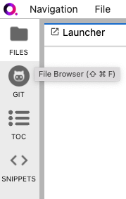
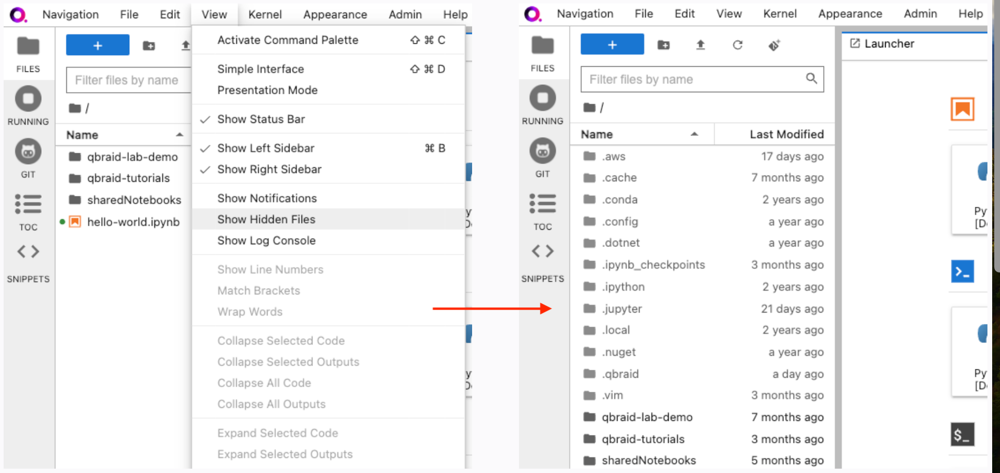
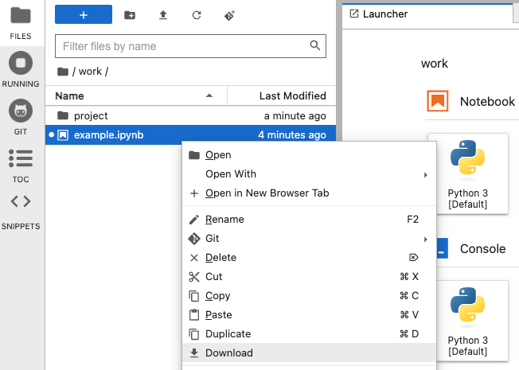
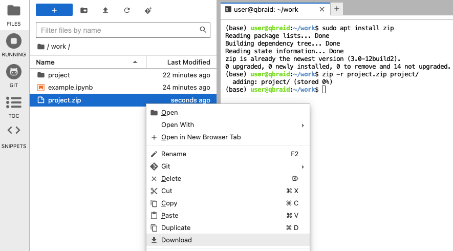

.. _lab_extensions:

Jupyter Extensions
===================

Lab extensions owned and managed by Jupyter.

Filebrowser
------------

The file browser and Files menu enable you to work with files and directories on your system. This includes opening, creating, deleting,
renaming, downloading, copying, and sharing files and directories. To open the file browser, click on the **FILES** tab in the left sidebar
(or use shortcut ``Cmd+Shift+F``).

The file system can be navigated by double-clicking on folders in the listing or clicking on the folders at the top of the directory listing.
To open any file, double-click on its name, or drag the file into the main work area to create a new tab.

Show hidden files
^^^^^^^^^^^^^^^^^^

From the top-bar menu, click on **View**, and then select **Show Hidden Files** to toggle the visibility of hidden files in the file browser.

Download files
^^^^^^^^^^^^^^^

To download a file, open the file browser, right click on the file, and select **Download** from the context menu.

Download directories
^^^^^^^^^^^^^^^^^^^^^

Downloading directories is not currently supported by the JupyerLab file browser. However, as a workaround, you can use the terminal to zip
the directory and then download the zip file.

First, open Terminal, and install ``zip`` using the following command:

.. code:: bash

    $ sudo apt install zip

Then, zip the directory using the zip command, specifying both the target directory's path and the desired name for the resulting zip file.
The ``-r`` option is essential as it instructs zip to include all subdirectories and their contents recursively. The general command format is as follows:

.. code:: bash

    $ zip -r output_filename.zip /path/to/directory

Finally, download the zip file using the file browser.

.. seealso::

    - `JupyterLab: Working with Files <https://jupyterlab.readthedocs.io/en/stable/user/files.html>`_

Table Of Contents (TOC)
------------------------

Table of Contents extension for JupyterLab.

.. seealso::

    - `jupyterlab-toc <https://jupyterlab.readthedocs.io/en/latest/user/toc.html>`_

Metadata
----------

Linked data exploration in JupyterLab.

.. seealso::

    - `jupyterlab-metadata-service <https://github.com/jupyterlab/jupyterlab-metadata-service>`_

Git
----

A Git extension for JupyterLab.

.. seealso::
    
    - `jupyterlab-git <https://github.com/jupyterlab/jupyterlab-git>`_

Resource Usage
---------------

Jupyter Notebook Extension for monitoring your own Resource Usage.

.. seealso::
    
    - `jupyter-resource-usage <https://github.com/jupyter-server/jupyter-resource-usage>`_

