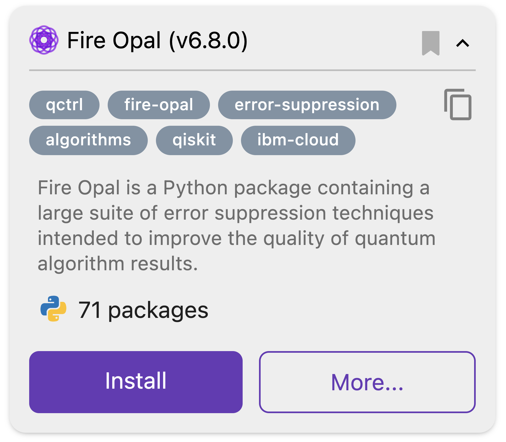
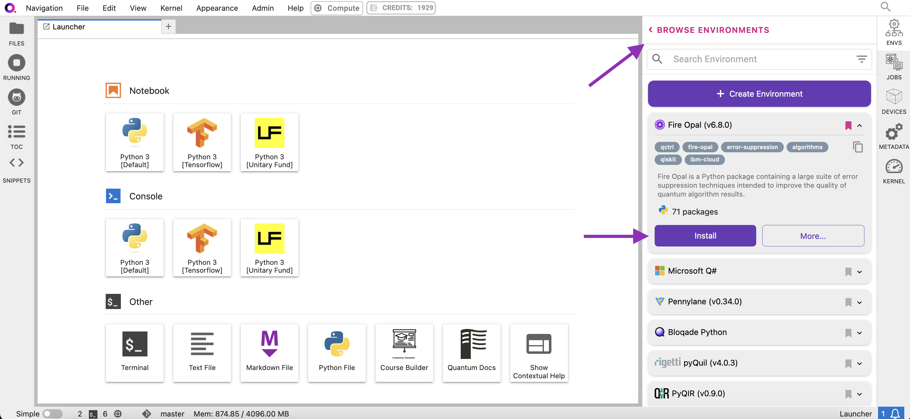
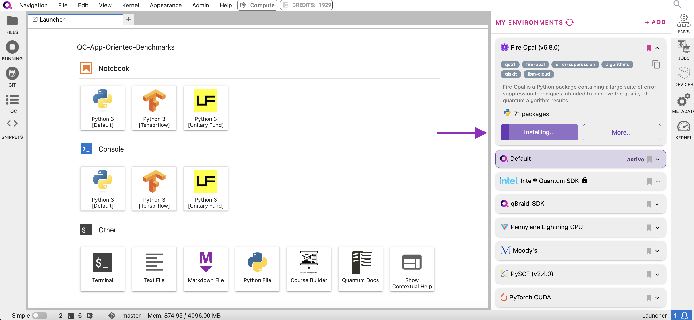
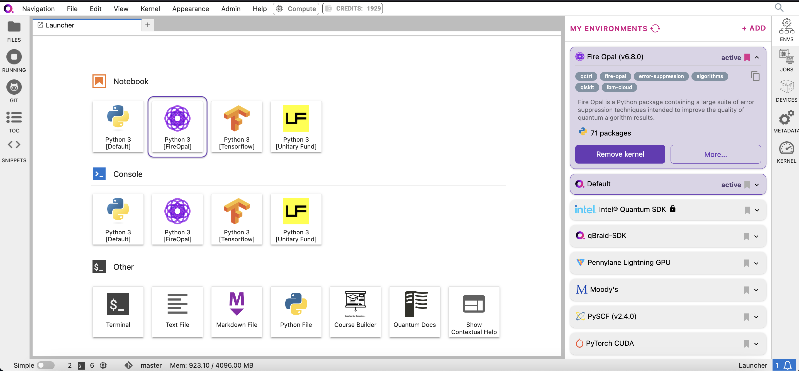
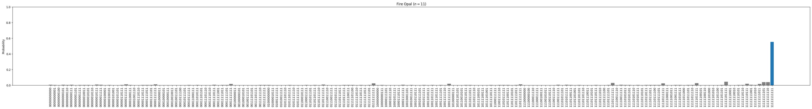
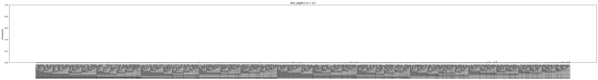

:orphan:

.. _lab_w:

Fire Opal
==========

Overview
---------

Fire Opal is a software package that makes it simple for anyone to achieve meaningful results from quantum computers. Using AI-driven error suppression, Fire Opal improves the success of algorithms by thousands of times and enables you to successfully scale to large problem sizes, without even having to worry about the details of quantum circuits. At the same time, reaching the correct answer takes fewer shots and requires no overhead, meaning that you save on compute cost. For an in-depth explanation of Fire Opal’s benefits and capabilities, check out the Fire Opal overview.

This tutorial will run through the steps to set up Fire Opal on the qBraid Lab platform and use
it to run a Bernstein-Vazirani circuit. After completion, you will
have demonstrated Fire Opal's benefits by comparing the success
probabilities of executing the circuit with both Fire Opal and
Qiskit.

|

Setup
------

\1. Sign up for a Q-CTRL account
^^^^^^^^^^^^^^^^^^^^^^^^^^^^^^^^^^

You will need to `sign up for a Q-CTRL
account <https://q-ctrl.com/fire-opal>`__ to run the Fire Opal
package.

\2. Install the Fire Opal Environment in qBraid Lab
^^^^^^^^^^^^^^^^^^^^^^^^^^^^^^^^^^^^^^^^^^^^^^^^^^^^^

**2a.** In the Environment Manager sidebar, click **Add** to view the environments available to install.

**2b.** Choose the Fire Opal environment, expand its panel, and click **Install**.

|

**2c.** Once the installation has started, the panel is moved to the **My Environments** tab.
Click **Browse Environments** to return to the **My Environments** tab and view its progress.

|

**2d.** When the installation is complete, the environment panel's action button will switch from
**Installing...** to **Add Kernel**. Click Add Kernel and open a new notebook to beginning coding with the Fire Opal environment.

|

**2e.** Verify that the Fire Opal environment is installed by running the following code in the new notebook.

.. code:: python

   import fireopal
   import qiskit
   from qiskit_ibm_runtime import QiskitRuntimeService
   import matplotlib.pyplot as plt
   import os

**2f.** You are now ready to use Fire Opal in the qBraid Lab environment! Proceed with the tutorial below to run a Bernstein-Vazirani circuit.

\3. Specify your Q-CTRL organization
^^^^^^^^^^^^^^^^^^^^^^^^^^^^^^^^^^^^^^

If you are a member of multiple organizations, you must specify which
organization to use by setting the organization parameter, as shown
below.

.. code:: python

   fireopal.config.configure_organization(organization_slug="organization_slug")

where ``organization_slug`` is the unique ID used to identify this
organization. You can check organization names and other details by
visiting your `Q-CTRL account <https://accounts.q-ctrl.com/>`__.

\4. Sign up for an IBM Cloud account
^^^^^^^^^^^^^^^^^^^^^^^^^^^^^^^^^^^^^^

While Fire Opal's techology is inherently backend agnostic, in this
tutorial we will run the circuit on an IBM Quantum backend device.

You will need to sign up for an `IBM Quantum
account <https://docs.quantum-computing.ibm.com/run/account-management>`__,
which you can use to access devices on the Open or Premium IBM
Quantum plans. Simply input your hub, group, project, and access
token to the `make_credentials_for_ibmq <https://docs.q-ctrl.com/references/fire-opal/fireopal/fireopal.credentials.make_credentials_for_ibmq.html>`__
function.

Alternatively, you can `authenticate with IBM
Cloud <https://docs.q-ctrl.com/references/fire-opal/fireopal/fireopal.credentials.make_credentials_for_ibmq.html>`__.
Visit the documentation for more information on how to `get
started <https://cloud.ibm.com/docs/quantum-computing?topic=quantum-computing-get-started>`__.

**Note:** IBM Quantum offers public access to some of their quantum
computers. However, queue times for public systems can be long, which
will cause delays in the execution steps of this guide (steps 5 and
7). These delays are extraneous to Fire Opal.

Demo: Running the Bernstein-Vazirani algorithm with Fire Opal
---------------------------------------------------------------

We'll use Fire Opal to run a Bernstein-Vazirani circuit. This
algorithm is broadly used to find a string from the outputs of a
black box function, though this information is not necessary for the
sake of running this example.

\1. Define helper functions
^^^^^^^^^^^^^^^^^^^^^^^^^^^^^

We will start by defining two helper functions:

-  ``draw_circuit``: draws our QASM circuit
-  ``plot_bv_results``: plots the results of our experiments

.. code:: python

   shot_count = 2048

   def draw_circuit(qasm_str: str):
         """Draws a QASM circuit."""
         circuit = qiskit.QuantumCircuit.from_qasm_str(qasm_str)
         display(circuit.draw(fold=-1))

   def plot_bv_results(results, hidden_string, title=""):
         """Plot a probability histogram and highlight the hidden string."""
         bitstrings = sorted(results.keys())

         def to_probability(value, total):
            if isinstance(value, float):
               return value
            return value / total

         probabilities = [to_probability(results[b], shot_count) for b in bitstrings]
         plt.figure(figsize=(50, 5))
         bars = plt.bar(bitstrings, probabilities)
         plt.xticks(rotation=90)

         for index, bitstring in enumerate(bitstrings):
            if bitstring != hidden_string:
               bars[index].set_color("grey")

         plt.ylabel("Probability")
         plt.ylim([0, 1])
         plt.title(title)
         plt.show()

\2. Provide the quantum circuit
^^^^^^^^^^^^^^^^^^^^^^^^^^^^^^^^^

Here, we will define the Bernstein-Vazirani circuit as an
`OpenQASM <https://openqasm.com/>`__ string and visualize it using
our previously defined helper function ``draw_circuit``. Such a
string can also be generated by exporting a quantum circuit written
with any quantum-specific Python library.

.. container:: cell code

   .. code:: python

      circuit_qasm = """OPENQASM 2.0;
      include "qelib1.inc";
      qreg q[12];
      creg c[11];
      x q[11];
      h q[0];
      h q[1];
      h q[2];
      h q[3];
      h q[4];
      h q[5];
      h q[6];
      h q[7];
      h q[8];
      h q[9];
      h q[10];
      h q[11];
      barrier q[0],q[1],q[2],q[3],q[4],q[5],q[6],q[7],q[8],q[9],q[10],q[11];
      cx q[0],q[11];
      cx q[1],q[11];
      cx q[2],q[11];
      cx q[3],q[11];
      cx q[4],q[11];
      cx q[5],q[11];
      cx q[6],q[11];
      cx q[7],q[11];
      cx q[8],q[11];
      cx q[9],q[11];
      cx q[10],q[11];
      barrier q[0],q[1],q[2],q[3],q[4],q[5],q[6],q[7],q[8],q[9],q[10],q[11];
      h q[0];
      h q[1];
      h q[2];
      h q[3];
      h q[4];
      h q[5];
      h q[6];
      h q[7];
      h q[8];
      h q[9];
      h q[10];
      h q[11];
      barrier q[0],q[1],q[2],q[3],q[4],q[5],q[6],q[7],q[8],q[9],q[10],q[11];
      measure q[0] -> c[0];
      measure q[1] -> c[1];
      measure q[2] -> c[2];
      measure q[3] -> c[3];
      measure q[4] -> c[4];
      measure q[5] -> c[5];
      measure q[6] -> c[6];
      measure q[7] -> c[7];
      measure q[8] -> c[8];
      measure q[9] -> c[9];
      measure q[10] -> c[10];
      """
      draw_circuit(circuit_qasm)

   .. container:: output display_data

      ::

               ┌───┐      ░                                                         ░ ┌───┐ ░ ┌─┐                              
          q_0: ┤ H ├──────░───■─────────────────────────────────────────────────────░─┤ H ├─░─┤M├──────────────────────────────
               ├───┤      ░   │                                                     ░ ├───┤ ░ └╥┘┌─┐                           
          q_1: ┤ H ├──────░───┼────■────────────────────────────────────────────────░─┤ H ├─░──╫─┤M├───────────────────────────
               ├───┤      ░   │    │                                                ░ ├───┤ ░  ║ └╥┘┌─┐                        
          q_2: ┤ H ├──────░───┼────┼────■───────────────────────────────────────────░─┤ H ├─░──╫──╫─┤M├────────────────────────
               ├───┤      ░   │    │    │                                           ░ ├───┤ ░  ║  ║ └╥┘┌─┐                     
          q_3: ┤ H ├──────░───┼────┼────┼────■──────────────────────────────────────░─┤ H ├─░──╫──╫──╫─┤M├─────────────────────
               ├───┤      ░   │    │    │    │                                      ░ ├───┤ ░  ║  ║  ║ └╥┘┌─┐                  
          q_4: ┤ H ├──────░───┼────┼────┼────┼────■─────────────────────────────────░─┤ H ├─░──╫──╫──╫──╫─┤M├──────────────────
               ├───┤      ░   │    │    │    │    │                                 ░ ├───┤ ░  ║  ║  ║  ║ └╥┘┌─┐               
          q_5: ┤ H ├──────░───┼────┼────┼────┼────┼────■────────────────────────────░─┤ H ├─░──╫──╫──╫──╫──╫─┤M├───────────────
               ├───┤      ░   │    │    │    │    │    │                            ░ ├───┤ ░  ║  ║  ║  ║  ║ └╥┘┌─┐            
          q_6: ┤ H ├──────░───┼────┼────┼────┼────┼────┼────■───────────────────────░─┤ H ├─░──╫──╫──╫──╫──╫──╫─┤M├────────────
               ├───┤      ░   │    │    │    │    │    │    │                       ░ ├───┤ ░  ║  ║  ║  ║  ║  ║ └╥┘┌─┐         
          q_7: ┤ H ├──────░───┼────┼────┼────┼────┼────┼────┼────■──────────────────░─┤ H ├─░──╫──╫──╫──╫──╫──╫──╫─┤M├─────────
               ├───┤      ░   │    │    │    │    │    │    │    │                  ░ ├───┤ ░  ║  ║  ║  ║  ║  ║  ║ └╥┘┌─┐      
          q_8: ┤ H ├──────░───┼────┼────┼────┼────┼────┼────┼────┼────■─────────────░─┤ H ├─░──╫──╫──╫──╫──╫──╫──╫──╫─┤M├──────
               ├───┤      ░   │    │    │    │    │    │    │    │    │             ░ ├───┤ ░  ║  ║  ║  ║  ║  ║  ║  ║ └╥┘┌─┐   
          q_9: ┤ H ├──────░───┼────┼────┼────┼────┼────┼────┼────┼────┼────■────────░─┤ H ├─░──╫──╫──╫──╫──╫──╫──╫──╫──╫─┤M├───
               ├───┤      ░   │    │    │    │    │    │    │    │    │    │        ░ ├───┤ ░  ║  ║  ║  ║  ║  ║  ║  ║  ║ └╥┘┌─┐
         q_10: ┤ H ├──────░───┼────┼────┼────┼────┼────┼────┼────┼────┼────┼────■───░─┤ H ├─░──╫──╫──╫──╫──╫──╫──╫──╫──╫──╫─┤M├
               ├───┤┌───┐ ░ ┌─┴─┐┌─┴─┐┌─┴─┐┌─┴─┐┌─┴─┐┌─┴─┐┌─┴─┐┌─┴─┐┌─┴─┐┌─┴─┐┌─┴─┐ ░ ├───┤ ░  ║  ║  ║  ║  ║  ║  ║  ║  ║  ║ └╥┘
         q_11: ┤ X ├┤ H ├─░─┤ X ├┤ X ├┤ X ├┤ X ├┤ X ├┤ X ├┤ X ├┤ X ├┤ X ├┤ X ├┤ X ├─░─┤ H ├─░──╫──╫──╫──╫──╫──╫──╫──╫──╫──╫──╫─
               └───┘└───┘ ░ └───┘└───┘└───┘└───┘└───┘└───┘└───┘└───┘└───┘└───┘└───┘ ░ └───┘ ░  ║  ║  ║  ║  ║  ║  ║  ║  ║  ║  ║ 
         c: 11/════════════════════════════════════════════════════════════════════════════════╩══╩══╩══╩══╩══╩══╩══╩══╩══╩══╩═
                                                                                               0  1  2  3  4  5  6  7  8  9  10

\3. Provide your device information and credentials
^^^^^^^^^^^^^^^^^^^^^^^^^^^^^^^^^^^^^^^^^^^^^^^^^^^^^

Next, we'll provide device information for the real hardware backend.
Fire Opal will execute the circuit on the backend on your behalf, and
it is designed to work seamlessly across multiple backend providers.
For this example, we will use an IBM Quantum hardware device.

Note that the code below requires your IBM Quantum API token. Visit
`IBM Quantum <https://quantum.ibm.com/>`__ to sign up for an account
and `obtain your access
credentials <https://docs.quantum-computing.ibm.com/run/account-management>`__.

.. code:: python

   # These are the properties for the publicly available provider for IBM backends.
   # If you have access to a private provider and wish to use it, replace these values.
   hub = "ibm-q"
   group = "open"
   project = "main"
   token = "YOUR_IBM_TOKEN"
   credentials = fireopal.credentials.make_credentials_for_ibmq(
         token=token, hub=hub, group=group, project=project
   )

   QiskitRuntimeService.save_account(
         token, instance=hub + "/" + group + "/" + project, overwrite=True
   )
   service = QiskitRuntimeService()

Next we will use the function ``show_supported_devices`` to list the
devices that are both supported by Fire Opal and accessible to you
when using the ``credentials`` above.

.. code:: python

   supported_devices = fireopal.show_supported_devices(credentials=credentials)[
         "supported_devices"
   ]
   for name in supported_devices:
         print(name)

From the resulting list, you can choose a backend device and replace
``"desired_backend"``. The list will only include devices accessible
to you.

.. code:: python

   # Enter your desired IBM backend here or select one with a small queue
   backend_name = "desired_backend"
   print(f"Will run on backend: {backend_name}")

\4. Validate the circuit and backend
^^^^^^^^^^^^^^^^^^^^^^^^^^^^^^^^^^^^^^

Now that we have defined our credentials and are able to select a
device we wish to use, we can validate that Fire Opal can compile our
circuit, and that it's compatible with the indicated backend.

.. code:: python

   validate_results = fireopal.validate(
         circuits=[circuit_qasm], credentials=credentials, backend_name=backend_name
   )

   if validate_results["results"] == []:
         print("No errors found.")
   else:
         print("The following errors were found:")
         for error in validate_results["results"]:
            print(error)

In this previous example, the output should be an empty list since
there are no errors in the circuit, i.e.
``validate_results["results"] == []``. Note that the length of the
``validate_results`` list is the total number of errors present
across all circuits in a batch. Since our circuit is error free, we
can execute our circuit on real hardware.

\5. Execute the circuit using Fire Opal
^^^^^^^^^^^^^^^^^^^^^^^^^^^^^^^^^^^^^^^^^

In the absence of hardware noise, only a single experiment would be
required to obtain the correct hidden string: ``111 111 111 11``.
However in real quantum hardware, noise disturbs the state of the
system and degrades performance, decreasing the probability of
obtaining the correct answer for any single experiment. Fire Opal
automates the adjustments made by experts when running circuits on a
real device.

.. note::

   Once jobs are submitted, there may be a delay in returning
   results due to the hardware provider's queue. You can `view and
   retrieve results
   later <https://docs.q-ctrl.com/fire-opal/user-guides/how-to-view-previous-jobs-and-retrieve-results>`__.
   Be sure to let your jobs finish executing, and do not cancel the
   process. Even in the case of kernel disconnection, the job will still
   complete, and results can later be retrieved.

.. code:: python

   print(
         "Submitted the circuit to IBM. Note: there may be a delay in getting results due to IBM "
         "device queues. Check the status through instructions at "
         "https://cloud.ibm.com/docs/quantum-computing?topic=quantum-computing-results."
   )
   real_hardware_results = fireopal.execute(
         circuits=[circuit_qasm],
         shot_count=shot_count,
         credentials=credentials,
         backend_name=backend_name,
   )

   bitstring_results = real_hardware_results["results"]

\6. Analyze results
^^^^^^^^^^^^^^^^^^^^^

Now you can look at the outputs from the quantum circuit executions.
The success probability is simply the number of times the hidden
string was obtained out of the total number of circuit shots. For
reference, running this circuit on a real device without Fire Opal
typically has a success probability of 2-3%. As you can see, Fire
Opal greatly improved the success probability.

.. code:: python

   print(f"Success probability: {100 * bitstring_results[0]['11111111111']:.2f}%")
   # Success probability: 55.19%

.. code:: python

   plot_bv_results(
         bitstring_results[0], hidden_string="11111111111", title=f"Fire Opal ($n=11$)"
   )    

\7. Compare Fire Opal Results with Qiskit
^^^^^^^^^^^^^^^^^^^^^^^^^^^^^^^^^^^^^^^^^^^

To get a true comparison, let's run the same circuit without Fire
Opal. We'll run the circuit using Qiskit on the same IBM backend as
used previously to get a one-to-one comparison.

.. code:: python

   from qiskit_ibm_runtime import Sampler, Options

   backend = service.backend(backend_name)
   options = Options()
   options.execution.shots = shot_count
   sampler = Sampler(backend=backend, options=options)

   circuit_qiskit = qiskit.QuantumCircuit.from_qasm_str(circuit_qasm)
   ibm_result = sampler.run(circuit_qiskit).result()
   ibm_probabilities = (
         ibm_result.quasi_dists[0]
         .nearest_probability_distribution()
         .binary_probabilities(num_bits=11)
   )

   print(f"Success probability: {100 * ibm_probabilities['11111111111']:.2f}%")
   # Success probability: 2.78%

.. code:: python

   plot_bv_results(
         ibm_probabilities, hidden_string="11111111111", title=f"{backend_name} ($n=11$)"
   )  

The above results demonstrate that noise has severely impacted the
probability of obtaining the correct hidden string as the output. In
this case, the string returned with the greatest frequency by the
quantum computer was not the expected ``111 111 111 11`` state. We
should also take note of the amount of incorrect states that now
contain non-zero return probabilities. Not only do default
configurations fail to find the correct answer, they also increase
the probabilities of the incorrect answers.

In fact, the performance degradation is so severe that in order to be
reasonably sure of the hidden string, using the original classical
algorithm would be more efficient.

You can tell that Fire Opal found the correct answer because the mode
of the output distribution, or the most frequent outcome, matches the
desired output: bitstring ``111 111 111 11``. Fire Opal significantly
improves the probability of a successful outcome, often by a factor
of ten or more.

.. code:: python

   fire_opal_success = bitstring_results[0]["11111111111"]
   ibm_success = ibm_probabilities["11111111111"]
   factor = int(fire_opal_success / ibm_success)
   print(f"Fire Opal improved success probability by a factor of {factor}!")
   # Fire Opal improved success probability by a factor of 19!   

Congratulations! You've run your first algorithm with Fire Opal and
demonstrated its ability in transforming a device which finds the
incorrect answer by default, to a device that finds the correct
answer.

.. seealso::

   - `Fire Opal Documentation <https://docs.q-ctrl.com/fire-opal>`_