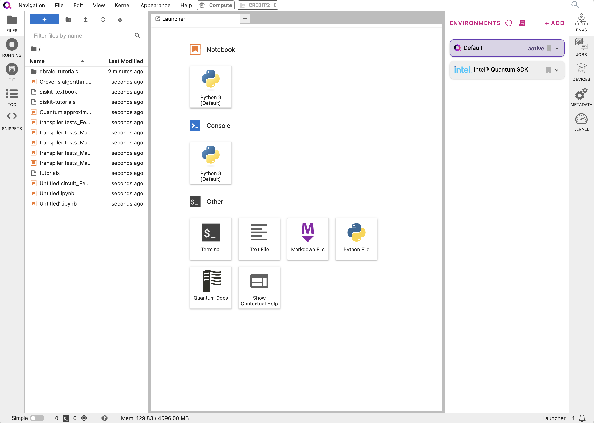

.. _lab_ibm_migration:

IBM Quantum Lab Migration Guide
=================================

Guide for IBM Quantum Lab Users on how to migrate their projects and development workflows to qBraid Lab.

Overview
----------

With the recent sunsetting of the IBM Quantum Lab, IBM Quantum has identified several vendors—including qBraid—as a preferred migration solution. This guide provides information on how to migrate all of your files and projects from the IBM Quantum Lab to qBraid Lab. qBraid streamlines the process for you, meaning that all of your notebooks and files will be able to run the same way they did on IBM Quantum Lab.

.. note::

   All data will be deleted from IBM Quantum Lab servers on 15 November, 2024. Make sure that you download everything by then; you can reupload your projects onto qBraid Lab.

Step 1: Download
-------------------

To start the migration process, you will need to download your files from IBM Quantum Lab.

1a. Visit IBM Quantum Lab and log in.
^^^^^^^^^^^^^^^^^^^^^^^^^^^^^^^^^^^^^^^

Go to the `IBM Quantum Lab <https://quantum.ibm.com/lab>`_. Upon landing, it will prompt you to enter your IBMid and password.

1b. Download your relevant files.
^^^^^^^^^^^^^^^^^^^^^^^^^^^^^^^^^^

Click the blue button labeled "Download data (.zip)". This will download a .zip file containing all of your projects and expand it in your Downloads folder.

Step 2: Launch
-----------------

After downloading your files, you can now migrate to qBraid Lab.

2a. Visit `qbraid.com <https://www.qbraid.com>`_ to open qBraid Lab.
^^^^^^^^^^^^^^^^^^^^^^^^^^^^^^^^^^^^^^^^^^^^^^^^^^^^^^^^^^^^^^^^^^^^^

When you're at the landing page, click the `"Start Now" button <https://account.qbraid.com/>`_ in the top-right corner in order to gain access to the qBraid Lab.

2b. Create your free qBraid account.
^^^^^^^^^^^^^^^^^^^^^^^^^^^^^^^^^^^^^

You can create your account by entering your email address and password, or you can sign up with Google. Creating a qBraid account is always free!

.. seealso::
    - `qBraid Accounts <account.html>`_

2c. Initialize qBraid Lab from the landing page.
^^^^^^^^^^^^^^^^^^^^^^^^^^^^^^^^^^^^^^^^^^^^^^^^^

When you have logged in, you will see your account page. Click the purple `"Launch Lab" button <https://lab.qbraid.com>`_ in order to open the qBraid Lab interface. This will open the qBraid Lab page, from where you can select the first "Free" version to get started.

Step 3: Upload
----------------

When your account is made, you can upload your files to qBraid Lab.

3a. Click on the "Files" icon.
^^^^^^^^^^^^^^^^^^^^^^^^^^^^^^^

The qBraid Lab server may take up to 5 minutes to initialize the first time. When you are in, you should see a page that looks like this:

Navigate to the "Files" icon in the left panel to access the file manager. You should see a folder titled "qbraid-tutorials".

3b. Upload the files onto qBraid Lab.
^^^^^^^^^^^^^^^^^^^^^^^^^^^^^^^^^^^^^^

To upload files, click the "Upload" icon in the file manager.

Your .zip folder containing your files from IBM Quantum Lab should be in your Downloads folder. After expanding, select all the files and hit "Open".

You can see now that all of the files that you were working on in the IBM Quantum Lab are now saved in your workspace in the qBraid Lab.

.. seealso::
    - `Notebooks on qBraid <notebooks.html>`_

Step 4: Execute
------------------

After all your files are uploaded, you can choose the environment you'd like to run them in. qBraid has a premium pre-installed Python environment with 135 relevant packages available. There are also customizable Qiskit environments to support the version that your code is written in.

4a. Navigate to the Environments icon in the right panel.
^^^^^^^^^^^^^^^^^^^^^^^^^^^^^^^^^^^^^^^^^^^^^^^^^^^^^^^^^^^

The qBraid environment is pre-selected, but you have the option to change this.

4b. Configure your environment with any version of Qiskit you need.
^^^^^^^^^^^^^^^^^^^^^^^^^^^^^^^^^^^^^^^^^^^^^^^^^^^^^^^^^^^^^^^^^^^^^

By searching for "Qiskit" in the Environments tab, you can select the version you need. If you need a version that is not available, you can create a custom environment by clicking "Create Environment".

.. seealso::
    - `qBraid Environments <environments.html>`_
    - `qBraid Kernels <kernels.html>`_

Conclusion
-------------

You have successfully migrated your projects from IBM Quantum Lab to qBraid Lab. We are proud to offer comprehensive support for all our users throughout this migration. If any issues appear, or if you have any questions, please reach out to us at `contact@qbraid.com <mailto::contact@qbraid.com>`_.
