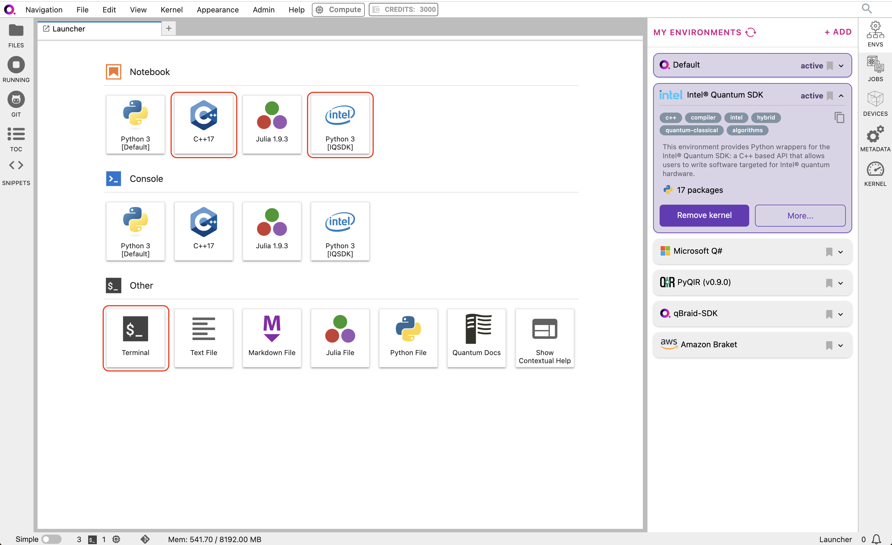

:orphan:

.. _lab_intel:

Intel® Quantum SDK
====================

Intel® Quantum SDK is a C++ based API that allows users to write software
targeted for Intel quantum hardware. It is available as a pre-installed
environment on qBraid Lab, and is free to access for all users:

|

To cite the Intel® Quantum SDK, please reference:

    Khalate, P., Wu, X.-C., Premaratne, S., Hogaboam, J., Holmes, A., Schmitz, A.,
    Guerreschi, G. G., Zou, X. & Matsuura, A. Y.,
    `arXiv:2202.11142 (2022). <https://doi.org/10.48550/arXiv.2202.11142>`_

The Intel® Quantum SDK is designed to interoperate with Python software
environments and we will use that feature in your first notebook.

Python Interface
------------------

The Intel® Quantum SDK Python Interface provides an API to run quantum algorithms using
Python 3, through the **intelqsdk.cbindings** library. The standard approach
to using the Intel® Quantum SDK is to provide a ``quantum_kernel`` as C++ source
in your Python environment and then expose that kernel for operation. A second approach
for interacting with Python is via the Intel® Quantum Compiler OpenQASM Bridge:

1. Write ``quantum_kernel`` functions in C++, compile to a ``.so`` shared object file, setup
   the Intel® Quantum Simulator and call the ``intelqsdk.cbindings`` APIs from Python.

2. Write quantum circuits in OpenQASM 2.0, convert that to a ``quantum_kernel`` source in C++,
   and use the ``intelqsdk.cbindings`` library as before, all from within Python.

.. raw:: html

    <h3 style="color:#D30982;">qBraid Specific Instructions</h3>

The Python interface is installed in the Intel® Quantum SDK environment
in qBraid. Before running this notebook, make sure that you have activated
the Intel® Quantum SDK environment, and have selected the ``Python [IQSDK]``
kernel in the top-right of your menu bar. To run your Python
scripts using the **intelqsdk.cbindings** library, you can use the qBraid CLI

.. code-block:: bash

    $ qbraid envs activate intel

or call your script with the full python3 path at

.. code-block:: bash

    $ /opt/.qbraid/environments/intel_dk7c2g/pyenv/bin/python3

Your First C++ Quantum Kernel
-----------------------------

We will create and manipulate a ``quantum_kernel`` running on the Intel® Quantum Simulator
directly in your notebook. This first kernel will demonstrate a simple quantum Bell state as
a common and familiar quantum computing example.

.. code-block:: python

    import intelqsdk.cbindings as iqsdk

    compiler = "/opt/.qbraid/environments/intel_dk7c2g/intel-quantum-compiler"

    num_qubits = 2

    # Create the Python interpolated 2 qubit C++ Bell state source
    Bell_source = f"""
    #include <clang/Quantum/quintrinsics.h>

    // Establish the classical and quantum kernel variables
    cbit c[{num_qubits}];
    qbit q[{num_qubits}];

    // Our Bell state Quantum Kernel
    quantum_kernel void bell()
    {{
        H(q[0]);
        CNOT(q[0], q[1]);
        MeasZ(q[0], c[0]);
        MeasZ(q[1], c[1]);
    }}
    """

    # Create the Intel® Quantum SDK source file bell.cpp
    with open("bell.cpp", "w", encoding="utf-8") as output_file:
        print(Bell_source, file=output_file)

    # Generate the Intel® Quantum SDK shared object file bell.so
    iqsdk.compileProgram(compiler, "bell.cpp", "-s")

    # Expose and label the Intel® Quantum SDK shared object as "my_bell"
    iqsdk.loadSdk("./bell.so", "my_bell")

    # Setup the Intel® Quantum Simulator to execute the quantum kernel
    iqs_config = iqsdk.IqsConfig()
    iqs_config.num_qubits = num_qubits
    iqs_config.simulation_type = "noiseless"
    iqs_device = iqsdk.FullStateSimulator(iqs_config)
    iqs_device.ready()

    # Invoke the quantum_kernel "bell" defined in the C++ source above
    iqsdk.callCppFunction("bell", "my_bell")

    # Establish references to the quantum kernel qubits
    qbit_ref = iqsdk.RefVec()
    for i in range(num_qubits):
        qbit_ref.append( iqsdk.QbitRef("q", i, "my_bell").get_ref() )

    # Print the probabilities of the quantum system
    probabilities = iqs_device.getProbabilities(qbit_ref)
    iqsdk.FullStateSimulator.displayProbabilities(probabilities, qbit_ref)

    # Printing probability register of size 4
    # |00>    : 0                             |10>    : 0
    # |01>    : 0                             |11>    : 1

.. raw:: html

    <h3 style="color:#D30982;">qBraid Specific Information</h3>

On qBraid, the Intel® Quantum Compiler is located in the ``intel`` environment directory.

.. code-block:: bash

    /opt/.qbraid/environments/intel_dk7c2g/intel-quantum-compiler

This environment path can also be found from the qBraid CLI via

.. code-block:: bash

    $ qbraid envs list
    # installed environments:
    #
    default                  jobs  /opt/.qbraid/environments/qbraid_000000
    intel                          /opt/.qbraid/environments/intel_dk7c2g
    ...

The Intel® `oneAPI <https://www.intel.com/content/www/us/en/developer/tools/oneapi/overview.html>`_ toolkit also comes pre-installed, and can be accessed at ``/opt/intel/oneapi``.

OpenQASM Support
----------------

Intel® Quantum SDK provides a source-to-source converter which takes OpenQASM
code and converts it into C++ for use with the Intel® Quantum SDK. This
converter requires Python >= 3.10. Currently, it only processes OpenQASM 2.0
compliant code as described by the Open Quantum Assembly Language paper:
`arXiv:1707.03429 <https://arxiv.org/abs/1707.03429>`_.

To translate an OpenQASM source to a C++ file, you can run the Intel® Quantum Compiler with
the -B flag to generate the corresponding ``quantum_kernel`` functions in C++ source
format. If you are working from the terminal CLI with a pre-existing OpenQASM file simply use the
following syntax to create your C++ ``quantum_kernel`` source file:

.. code-block:: bash

    $ intel-quantum-compiler -B example.qasm

Working with inline OpenQASM content insert the following code into the above notebook, replacing the
two sections there identified by comments starting with "Create " and re-run;

.. code-block:: python

    # Create the Python interpolated 2 qubit OpenQASM Bell state source
    Bell_source = f"""
    OPENQASM 2.0;
    qreg q[{num_qubits}];
    creg c[{num_qubits}];
    h q[0];
    cx q[0],q[1];
    measure q[0] -> c[0];
    measure q[1] -> c[1];
    """

    # Create the OpenQASM 2.0 source file bell.qasm
    with open("bell.qasm", "w", encoding="utf-8") as output_file:
        print(Bell_source, file=output_file)

    # Create the Intel® Quantum SDK source file bell.cpp
    iqsdk.compileProgram(compiler, "bell.qasm", "-B")

As a further alternative to a OpenQASM file or an inline OpenQASM source, it is also
possible to start from a Qiskit quantum algorithm and transpile to OpenQASM:

.. code-block:: python

    from qiskit import QuantumCircuit

    # Create Qiskit bell circuit with measurement over both qubits
    circuit = QuantumCircuit(2, 2)
    circuit.h(0)
    circuit.cx(0, 1)
    circuit.measure([0, 1], [0, 1])

    Bell_source = circuit.qasm()

Enjoy exploring the possibilities of quantum computing with the Intel® Quantum SDK.
