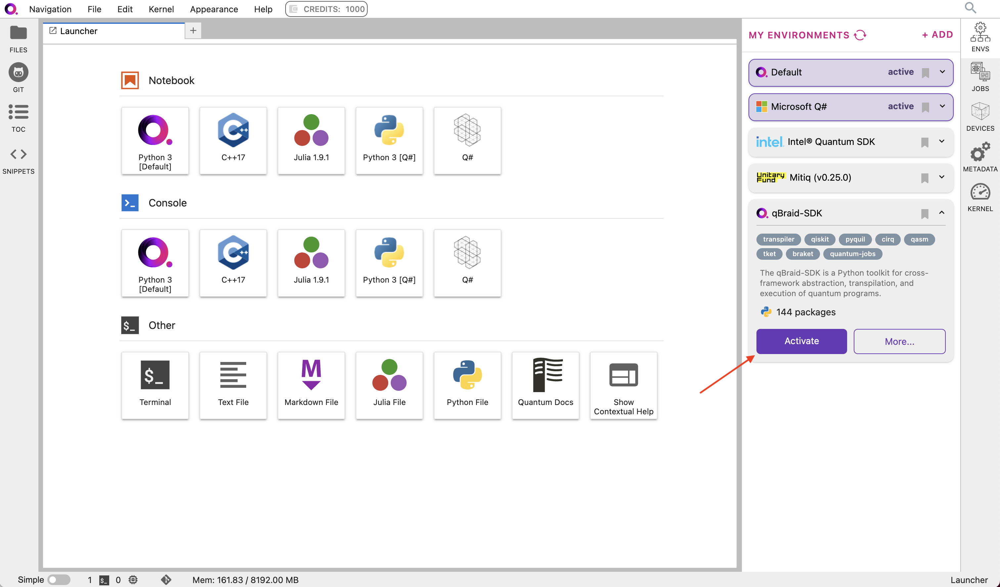
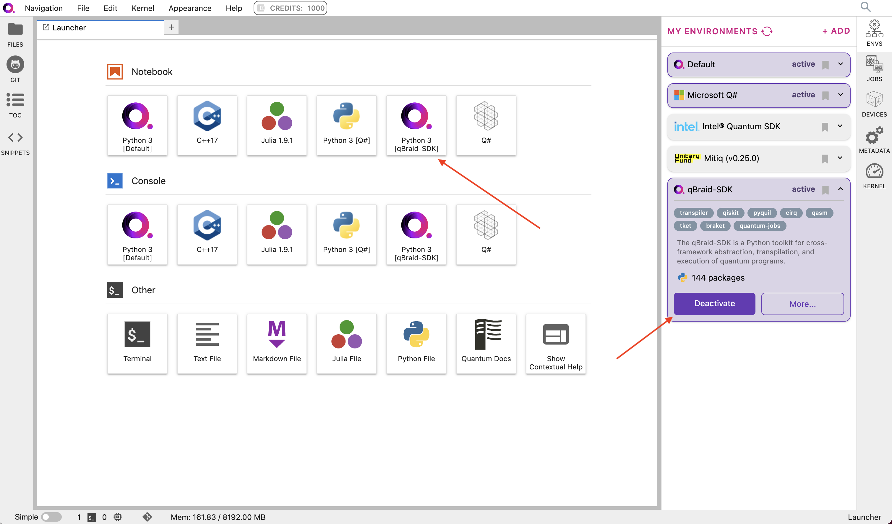
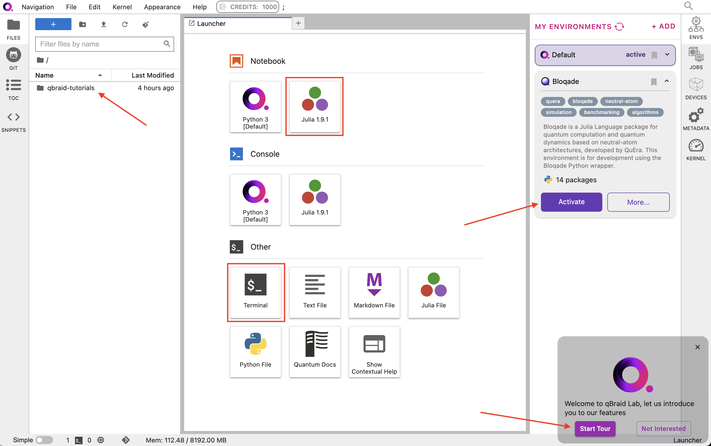
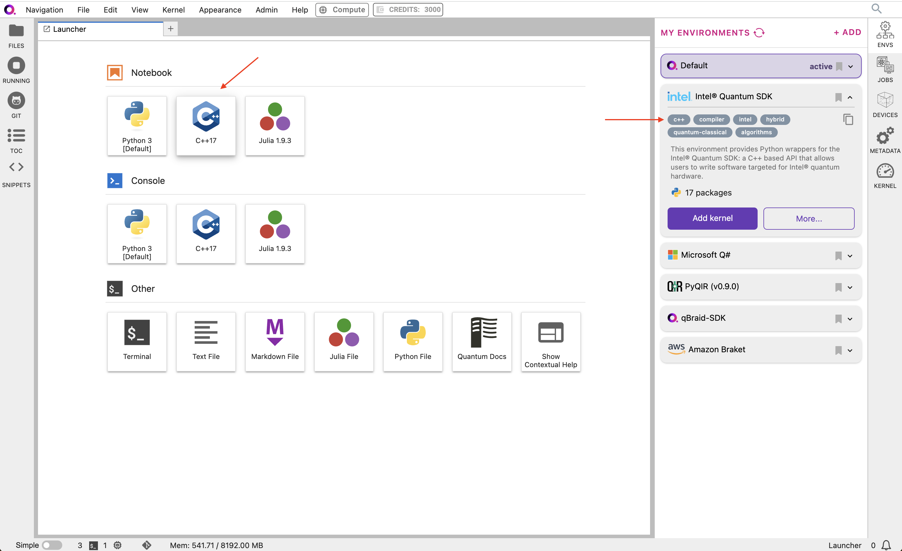

.. _lab_kernels:

Kernels
=========

Add/remove kernel
-------------------

The IPython kernel is the Python execution backend for Jupyter.

Under **My Environments**, choose the environment, and expand its pannel.
Click **Activate** to activate the environment and create an associated ipykernel.

|

Once active, click **Deactivate** to deactivate an environment, and remove its ipykernel
from the launcher.

|

Julia
------

`Julia <https://julialang.org/>`_ is a high-performance, high-level programming language known for its ease of use and impressive computational
capabilities, especially in numerical and scientific computing, machine learning, data science, and most recently, quantum computing! Julia is
available on qBraid Lab with pre-configured IJulia notebooks, and with a number of quantum computing software packages pre-installed.

Bloqade Lab Image
^^^^^^^^^^^^^^^^^^

`Bloqade <https://queracomputing.github.io/Bloqade.jl/stable/>`_ is a `Julia Language <https://julialang.org/>`_ package developed for
quantum computation and quantum simulation based on the neutral-atom architecture with the ability to submit tasks to
`QuEra's Aquila quantum processor <https://www.quera.com/aquila>`_. Bloqade is available working out-of-the-box through qBraid Lab, is free-to-use,
and requires little to no setup.

For more, see `Bloqade Lab Image <bloqade.html>`_.

  
|

Configuration
^^^^^^^^^^^^^^

In qBraid Lab, the ``JULIA_DEPOT_PATH`` is set to ``/opt/.julia``. This default setting means that any additional Julia packages
installed will be stored at the system level, and therefore will not persist between sessions. To persist additional packages,
caches, configs, and other Julia updates, they must be saved at the user level (e.g. ``/home/jovyan/.julia``). This can be done by updating
the depot path:

.. code-block:: bash
    
    export JULIA_DEPOT_PATH="/home/jovyan/.julia:$JULIA_DEPOT_PATH"

See `Julia environment variables <https://docs.julialang.org/en/v1/manual/environment-variables/#JULIA_DEPOT_PATH>`_ for more.

Troubleshooting
^^^^^^^^^^^^^^^^

**Julia kernel not connecting**: If you are unable to connect to the Julia kernel, make sure that you do not have any ``Project.toml`` or ``Manifest.toml`` in your working directory,
as these project dependencies may conflict with pre-installed packages and cause the kernel to fail. If you are still having trouble, try restarting
your session. If the problem continues to persist, please `contact us <https://qbraid.com/contact-us/>`_.

.. seealso::

    `Project.toml and Manifest.toml <https://pkgdocs.julialang.org/v1/toml-files/#Project-and-Manifest>`_

C++
-----

C++ is a powerful and high-performance programming language, celebrated for its efficiency and precise control over system resources.
On qBraid Lab, quantum software programs developed in C++ are executable both through the command-line, and through the interactive
``xeus-cling`` Jupyter kernel. This kernel, built on the robust C++ interpreter ``cling`` and the native implementation of the Jupyter
protocol ``xeus``, facilitates interactive C++ programming directly within Jupyter notebooks.

Environments that support C++ software packages are marked with the ``c++`` tag.

Intel® Quantum SDK
^^^^^^^^^^^^^^^^^^^^

Intel Quantum SDK is a C++ based API that allows users to write software targeted for Intel quantum hardware. It is available as a pre-installed
environment on qBraid Lab, and is free to access for all users.

For more, see `Intel Quantum SDK environment <intel.html>`_.

|
