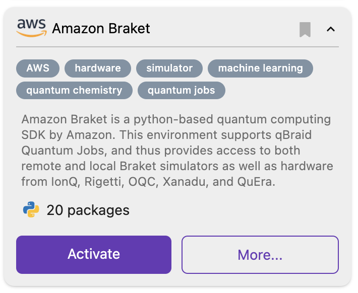
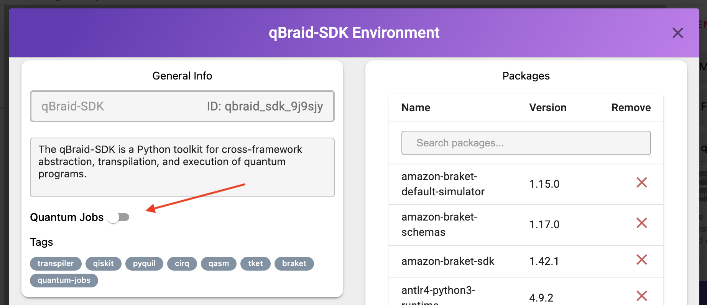
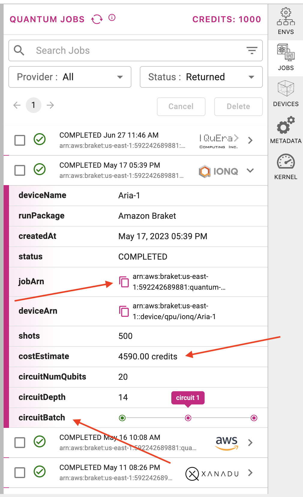
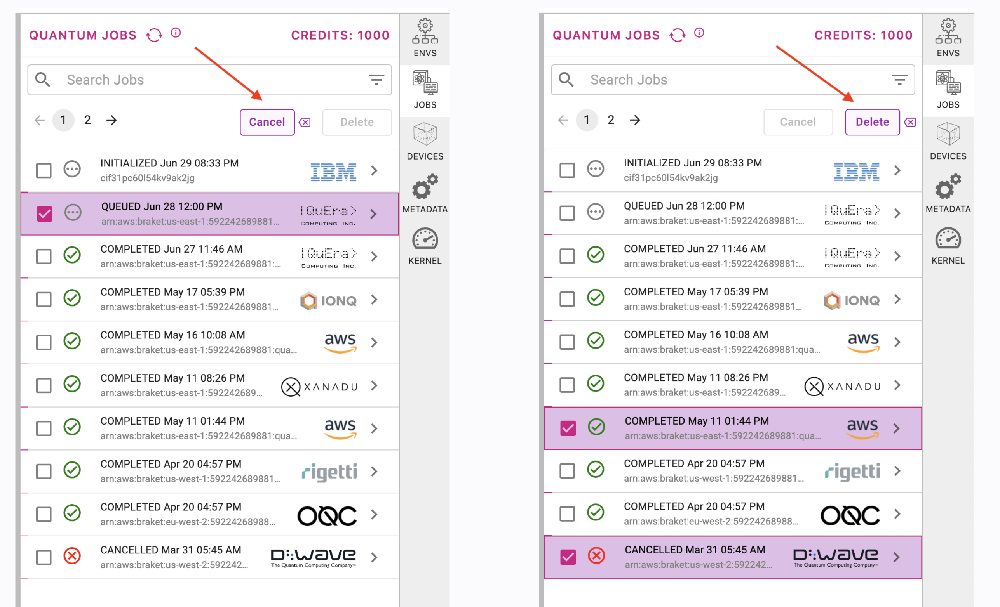

.. _lab_quantum_jobs:

Quantum Jobs
=============

qBraid Quantum Jobs give Lab users direct access to QPU devices from IonQ, Oxford Quantum Circuits, QuEra, and Rigetti,
as well as on-demand simulators from AWS, all with no additional access keys required.

.. note::
    
    Currently, qBraid Quantum Jobs only supports standard AWS Quantum Tasks. The application of qBraid credits towards Amazon Braket Hybrid Jobs is not yet available.

Credits
--------

Each time you run a program on a QPU or on-demand simulator using qBraid Quantum Jobs, credits are subtracted from your account according to the cost of the job.
The cost is calculated using a per-shot and per-task rate for QPUs, and a per-minute rate for simulators. See `pricing <pricing.html>`_.

Each qBraid credit is worth $.01 USD, so a quantum job costing $3.80 would subtract 380 credits from your qBraid balance. Credits can be `purchased <https://account.qbraid.com/billing.>`_
from your account page, or `redeemed <account.html#add-access-key>`_ using an access key. You can check your current credit balance on your `account page <https://account.qbraid.com/billing.>`_,
in the ``QJOBS`` sidebar on Lab, or using the `CLI <../cli/jobs-get-credits.html>`_:

.. code-block::

    $ qbraid credits

Which environments?
--------------------

Environments listed in the Environment Manager with the ``quantum jobs`` tag have pre-configured support for qBraid Quantum Jobs.

You can also use the CLI to see which of your installed environments support Quantum Jobs with the `qbraid envs list <../cli/envs-list.html>`_ command.

Environments with the ``jobs`` keyword listed before their path support qBraid Quantum Jobs.
Green or red highlighting over the ``jobs`` keyword (not pictured) indicates whether jobs are enabled or disabled for that environment.

.. code-block::
   
    $ qbraid envs list
    # installed environments:
    #
    qsharp                         /opt/.qbraid/environments/qsharp_b54crn
    default                  jobs  /opt/.qbraid/environments/qbraid_000000
    qiskit                         /home/jovyan/.qbraid/environments/qiskit_9y9siy
    amazon_braket            jobs  /home/jovyan/.qbraid/environments/aws_braket_kwx6dl
    custom_env                     /home/jovyan/.qbraid/environments/custom_env_lj3zlt

qBraid Quantum Jobs are not limited to environments with pre-configured support. You can `add <../cli/jobs-add.html>`_ Quantum Jobs to any environment that has Amazon Braket installed:

.. code-block::

   $ qbraid jobs add [env_name]

Enable/disable
---------------

To use Quantum Jobs in an environment, they must be enabled. This can be done using
the Quantum Jobs toggle in the Environment Manager, or using the qBraid CLI.

Quantum Jobs Toggle
^^^^^^^^^^^^^^^^^^^^^

To enable/disable Quantum Jobs from the Environment Manager, simply click the environment's **More** button,
and then flip the Quantum Jobs Toggle (located under the **General Info** section). Flipped to the *left* means
quantum jobs are *disabled*; flipped to the *right* means quantum jobs are *enabled*.

|

CLI Command
^^^^^^^^^^^^^

To enable Quantum Jobs from Terminal, use the qBraid CLI `jobs enable <../cli/jobs-enable.html>`_ command:

.. code-block::

    $ qbraid jobs enable [env_name]

You can also enable Quantum Jobs from inside a notebook using the ``!`` operator. This extra character, put at the beginning of the command, indicates that what you've entered is a bash command and not Python code.

To `disable <../cli/jobs-disable.html>`_ Quantum Jobs and run programs using your own AWS credentials, enter

.. code-block::

    $ qbraid jobs disable [env_name]

To reset your AWS credentials, follow instructions `Quick configuration with aws configure <https://docs.aws.amazon.com/cli/latest/userguide/cli-configure-quickstart.html#cli-configure-quickstart-config>`_.

Manage
-------

Before executing/submitting your quantum program, make sure that your notebook kernel matches the correct environment, and
that Quantum Jobs are enabled. From the Quantum Jobs sidebar, you can view the details of your submitted jobs, monitor the
status of each job, and track your credits.

In the example to the right, a batch of 3 quantum jobs were submitted to IonQ Aria-1 device. Each job used 500 shots,
so the cost was ~4590 qBraid credits, equivalent to $45.90 USD.

At any time, it's now incredibly easy to retrieve the Job ID, recreate the ``AwsQuantumTask`` object in a new program, and get the results:

.. code-block:: python

    from braket.aws import AwsQuantumTask

    # Job ID (arn) copied over from sidebar
    task = AwsQuantumTask(arn="arn:aws:braket:us-east-1:..." )

    task.result()
    ...

Submit and manage jobs via the qBraid-SDK
^^^^^^^^^^^^^^^^^^^^^^^^^^^^^^^^^^^^^^^^^^^

On qBraid, the devices you can access are not restricted by your choice of programming framework. Target any of our 20+ supported QPUs and simulators
from Qiskit, Amazon Braket, Cirq, PyQuil, PyTKET, or OpenQASM using the `qBraid-SDK <https://docs.qbraid.com/en/latest/sdk/overview.html>`_.

qBraid device wrappers can be used execute circuits on quantum backends. Using the OQC Lucy QPU as our example target backend, the procedure is as follows:

.. code-block:: python

    >>> from qbraid import device_wrapper
    >>> qdevice = device_wrapper('aws_oqc_lucy')
    >>> qjob = qdevice.run(circuit)
    >>> qjob.status()
    <JobStatus.QUEUED: 1>

Once a quantum job is complete, use the result method to gather the result:

.. code-block:: python

    >>> qjob.wait_for_final_state()
    >>> qjob.status()
    <JobStatus.COMPLETED: 6>
    >>> qresult = qjob.result()
    >>> qresult.measurement_counts()
    {'0': 136, '1': 864}

Then, to retrieve the final cost of the quantum job:

.. code-block:: python

    >>> qjob.get_cost() # returns cost in USD
    0.00375

.. seealso::

    - `qBraid-SDK Quantum Jobs <https://docs.qbraid.com/en/latest/sdk/jobs.html>`_
    - `qBraid-SDK Providers <https://docs.qbraid.com/en/latest/api/qbraid.providers.html>`_

Cancel/delete jobs
--------------------

You can cancel and delete jobs using the Quantum Jobs sidebar. You can only delete jobs that have reached a
final state, and can only cancel jobs that have not yet reached a final state (e.g. ``COMPLETED`` or ``FAILED``).

|

.. seealso::

    - `Using access codes to connect to quantum devices on qBraid | Demo <https://youtu.be/K4vb2fzmSZQ>`_
    - `qBraid Quantum Jobs Lab Demo Notebook <https://github.com/qBraid/qbraid-lab-demo/blob/main/qbraid_quantum_jobs.ipynb>`_
